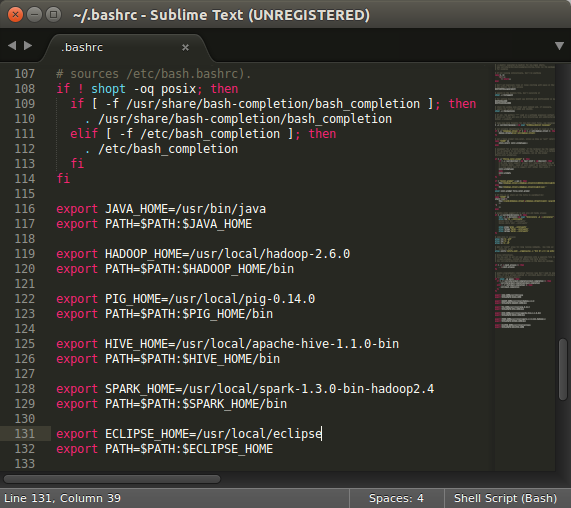

# Hadoop and Spark Exercise

Tasks:

1. [Install Hadoop 2.6](README.md#1-install-hadoop-26)
2. [Install Pig 0.14](README.md#2-install-pig-014)
3. [Install Hive 1.1.0](README.md#3-install-hive-110)
4. [Install Spark 1.3.0](README.md#4-install-spark-130)
5. [Add environment variables](README.md#5-add-environment-variables)
6. [Start HDFS](README.md#6-start-hdfs)
7. [Write jobs](README.md#7-write-jobs)
8. [Compare results and benchmark](README.md#8-compare-results-and-benchmark)

The purpose of this exercise is to implement a map reduce job across both a Hadoop and Spark framework. Fellows should consider the advantages and disadvantages of these frameworks. Solutions are provided, but it is best if fellows work through each implementation on their own and/or with other fellows. The data set used for this exercise is commodity price data from September 2013 to December 2014. Each row contains the last price the commodity was traded at. Timestamps are in UTC time.  

Column definition: Timestamp, Price, Volume

Timestamp string format: 

```
"yyyymmdd HHMMSS"
"20140601 220315"
```

![price_data_snippet] (images/price_data_snippet.png)

The full dataset can be downloaded from [Google Drive](https://drive.google.com/folderview?id=0B9BcjDEfpflMfnFlUVQtSDIzT0FxbzNkSFF1OWptQkpQTVpfRlJnSU45VHY3X0hLdDQ0clE&usp=sharing)

The task is to implement in the various frameworks the average price and total volume for each 30 minute interval. Output should look like the following:

![min30_output] (images/min30_output.png)

## 1. Install Hadoop 2.6
    
    $ wget http://mirror.nexcess.net/apache/hadoop/common/stable/hadoop-2.6.0.tar.gz
    $ tar -zxvf hadoop-2.6.0.tar.gz -C /usr/local
    
After extraction, go to [Insight Hadoop dev](https://sites.google.com/a/insightdatascience.com/dataengineering/devsetups/hadoop) to complete the Hadoop and HDFS setup.

## 2. Install Pig 0.14

    $ wget http://psg.mtu.edu/pub/apache/pig/pig-0.14.0/pig-0.14.0-src.tar.gz 
    $ tar -zxvf pig-0.14.0-src.tar.gz -C /usr/local

## 3. Install Hive 1.1.0

    $ wget http://apache.mirrors.lucidnetworks.net/hive/stable/apache-hive-1.1.0-bin.tar.gz
    $ tar -zxvf apache-hive-1.1.0-bin.tar.gz -C /usr/local

## 4. Install Spark 1.3.0

    $ wget http://www.apache.org/dyn/closer.cgi/spark/spark-1.3.0/spark-1.3.0-bin-hadoop2.4.tgz
    $ tar -zxvf spark-1.3.0-bin-hadoop2.4.tgz -C /usr/local

Use the [Insight Spark dev](https://sites.google.com/a/insightdatascience.com/dataengineering/devsetups/spark-dev) to complete the setup.

## 5. Add environment variables
Add to ~/.bashrc



    $ source ~/.bashrc

## 6. Start HDFS

Since HDFS is shutdown each time on a local machine, the following bash scripts can be used to start HDFS, load and clear data in HDFS:

- start_hdfs.sh: starts HDFS (modify as needed)
- load_hdfs.sh: loads data into HDFS (modify as needed)
- clear_hdfs.sh: clears data from HDFS since overwriting will result in an error (modify as needed)

Be sure to set the scripts as executables

    $ sudo chmod +x start_hdfs.sh load_hdfs.sh clear_hdfs.sh
    
On each local machine start up run the following:

    $ ./start_hdfs.sh
    $ ./load_hdfs.sh
    
## 7. Write jobs
1. Convert timestamp to 30 minute intervals
2. Compute total volume for each time interval
3. Compute average price for each time interval
4. Write output to HDFS

Hadoop/Spark hints
- File hierarchy setup

```
project
     -> pig
         -> price_data.pig
         -> string_manip.py
     -> hive
         -> price_data.sql
     -> spark
           -> project.sbt
           -> src
               -> main
                    -> scala
                          -> price_data.scala
```

- Pig
  - Use UDFs for string manipulations
  - Run with the following command:
    
    ```
    $ pig -x mapreduce price_data.pig
    ```


- Hive
  - Create a table
  - Use concat, substr, if for string manipulations
  - Run with the following command:
    
    ```
    $ hive -f price_data.sql
    ```


- Spark
  - Compile with sbt
    
    ```
    $ sbt package
    ```

  - jar file will reside in target/scala-2.10
  - Run with the following command:
    
    ```
    $ spark-submit --class "price_data" --master local[8] target/scala-2.10/price_data_2.10-1.0.jar
    ```


## 8. Compare results and benchmark

Personal benchmark run locally on i7 with 8GB RAM and 250GB SSD

|File Group        |File Size|Pig     |Hive    |Spark   |
|:----------------:|:-------:|:------:|:------:|:------:|
|price_data_snippet|1.7MB    |0m10.46s|0m11.12s|0m05.60s|
|price_data_full   |670MB    |3m15.53s|1m20.77s|0m39.73s|

Things to consider:
- ease of implementation
- code length
- speed
